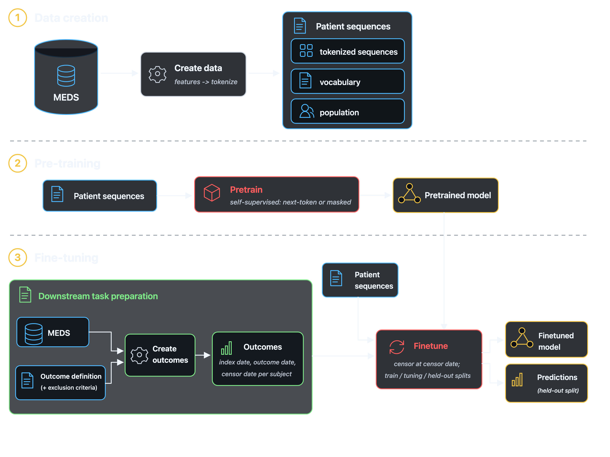

<p align="center">
  
</p>

<p align="center">
  <strong>Transformer models for Electronic Health Records, end to end: MEDS in, patient-level predictions out.</strong>
</p>

<p align="center">
  <a href="https://doi.org/10.21105/joss.08869"></a>
  <a href="https://github.com/FGA-DIKU/BONSAI/actions/workflows/pipeline.yml"></a>
  <a href="https://github.com/FGA-DIKU/BONSAI/actions/workflows/unittests.yml"></a>
  <a href="https://github.com/FGA-DIKU/BONSAI/actions/workflows/lint.yml"></a>
  <a href="https://github.com/FGA-DIKU/BONSAI/actions/workflows/format.yml"></a>
  
  <a href="LICENSE"></a>
</p>

BONSAI turns raw EHR data into tokenized patient histories, pretrains a transformer on them (autoregressive GPT-style or masked BERT-style), and finetunes it to predict clinical outcomes. It is the successor of [CORE-BEHRT](https://github.com/mikkelfo/CORE-BEHRT), rebuilt on PyTorch Lightning and Hydra for large-scale, reproducible experiments.

## What it does

- **Data creation.** Reads [MEDS](https://github.com/Medical-Event-Data-Standard/meds)-formatted records and builds temporally ordered sequences of medical concepts with age, time and segment features. Numeric values can be binned into tokens; concepts can be merged or dropped by regex.
- **Pretraining.** Next-token (causal) or masked-token prediction with a transformer implemented in the repo (RoPE, flash-attention or PyTorch SDPA backend), no HuggingFace dependency.
- **Outcomes and cohorts.** Standardized outcome files plus two censoring schemes: post-hoc censoring around each outcome, or a simulated prospective cutoff date.
- **Finetuning and prediction.** Binary outcome prediction from a linear head on the prediction token, predictions on a held-out split, warmup learning rate schedules and resumable, versioned runs.
- **Runs anywhere.** Every step is a Hydra config; the bundled example data runs the full pipeline on a laptop in minutes.

<p align="center">
  
</p>

## Quickstart

Requires Python 3.12.

```bash
git clone https://github.com/FGA-DIKU/BONSAI.git
cd BONSAI
pip install -e .            # add ".[flash_attn]" for the flash-attention backend (needs GCC >= 9)
cp template_env .env        # edit to point at your configs, data and checkpoint directories
```

Run the whole pipeline on the bundled synthetic MEDS data:

```bash
# 1. MEDS -> features + tokenized sequences, saved to data/processed_data/correlated_MEDS_data
python bonsai/run/create_data.py --config-name examples/example_data dataset=correlated_MEDS_data

# 2. Pretrain a small encoder with masked language modeling
python bonsai/run/pretrain.py --config-name examples/example_pretrain dataset=correlated_MEDS_data

# 3. Build outcome labels -> data/processed_data/correlated_MEDS_data/outcomes/examples/example_outcome1.parquet
python bonsai/run/create_outcome.py --config-name examples/example_outcome1 dataset=correlated_MEDS_data

# 4. Finetune the pretrained model on that outcome (checkpoints are written to data/models/<dataset>/<config>/run_id_<id>/version_0/)
python bonsai/run/finetune.py --config-name examples/example_finetune dataset=correlated_MEDS_data outcome=examples/example_outcome1 pretrain_path=data/models/correlated_MEDS_data/examples/example_pretrain/run_id_<id>/version_0/best.ckpt

# 5. Or train from scratch, skipping step 2
python bonsai/run/train.py --config-name examples/example_finetune dataset=correlated_MEDS_data outcome=examples/example_outcome1
```

The example configs live in [`configs/examples/`](configs/examples/). Every value can be overridden on the command line with Hydra's `key=value` syntax; the `*_val` variants show the pipeline with numeric lab values.

## Bring your own data

**Input** is a MEDS dataset. Point `paths.input_dir` at it in a data-creation config and set `dataset=<name>`.

**Outcomes** are produced by [`create_outcome.py`](bonsai/run/create_outcome.py). If it does not fit your case, supply your own `.parquet` with five columns:

| column | meaning |
|---|---|
| `subject_id` | the person of interest |
| `split` | `train`, `tuning` or `held_out`; one file covers all splits |
| `outcome_date` | when the outcome happened, nullable |
| `index_date` | when prediction starts, required |
| `censor_date` | data cutoff, required |

Place the file at `<processed data>/<dataset>/outcomes/<name>.parquet` and pass `outcome=<name>`, or point `paths.outcome=/absolute/path/to/outcomes.parquet` at it directly.

## Resume training

Pass the `last.ckpt` of the run and its original run id. Without `run_id` a new run directory is created.

```bash
python bonsai/run/pretrain.py --config-name examples/example_pretrain dataset=correlated_MEDS_data paths.ckpt_path=data/models/correlated_MEDS_data/examples/example_pretrain/run_id_1234/version_0/last.ckpt run_id=1234
```

## Related projects

- [CORE-BEHRT](https://github.com/mikkelfo/CORE-BEHRT): the predecessor framework BONSAI grew out of.
- [PHAIR_EHR](https://github.com/kirilklein/PHAIR_EHR): BONSAI extended for causal inference, with cohort matching, joint exposure/outcome finetuning and IPW/AIPW/TMLE effect estimation.

## Contributing

We welcome contributions! Please see our [Contributing Guidelines](CONTRIBUTING.md) for details on:

- Code style and formatting
- Testing requirements
- Pull request process
- Issue reporting

## License

This project is licensed under the MIT License - see the [LICENSE](LICENSE) file for details.

## Citation

If you use BONSAI in your research, please cite the following paper:

```bibtex
@article{Montgomery2025,
  author = {Montgomery, A. and others},
  title = {BONSAI: A framework for processing and analysing {E}lectronic {H}ealth {R}ecords ({EHR}) data using transformer-based models},
  journal = {Journal of Open Source Software},
  volume = {10},
  number = {114},
  pages = {8869},
  year = {2025},
  doi = {10.21105/joss.08869}
}
```
